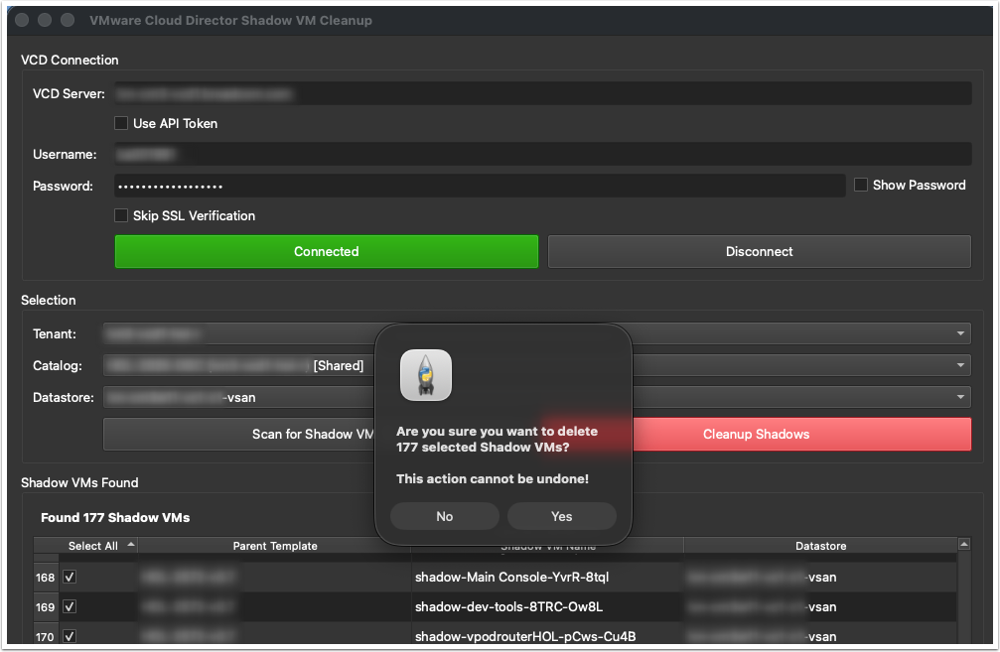
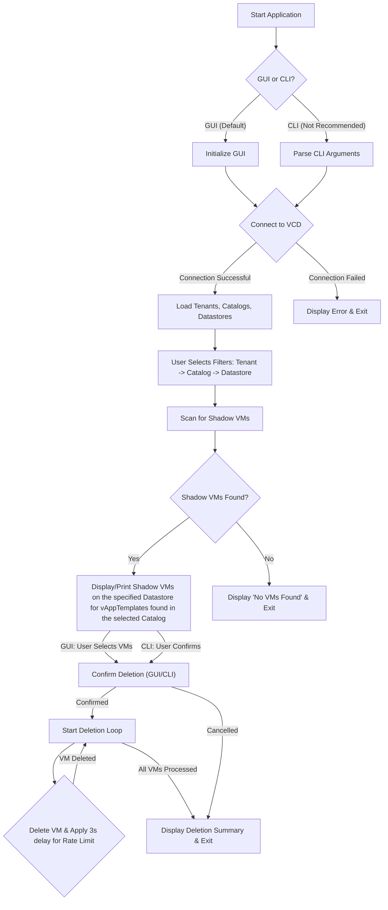

# VMware Cloud Director Shadow VM Cleaner


A Python application for managing Shadow VMs in VMware Cloud Director. This tool helps identify and clean up Shadow VMs that may accumulate over time, particularly after datastore re-allocations. It allows you to remove all or select Shadow VMs from a specified datastore.

## WARNING - USE WITH CAUTION

> [!CAUTION]
> This script is designed to DELETE content from VMware Cloud Director. Deletion will not occur until you click the "Yes" button on the confirmation popup that appears when you click the Cleanup Shadows button. Verify and re-verify before proceeding since the delete will be a permanent action that cannot be undone.



## Features

* **GUI:** User-friendly graphical interface for easy interaction.
* **Authentication:** Supports API token and username/password authentication to VCD.
* **Tenant Support:** Ability to specify a tenant or use the system tenant (provider).
* **Catalog and Datastore Filtering:** Scan for Shadow VMs within a specific catalog and on a particular datastore.
* **Dry Run:** Preview deletion operations without making actual changes.
* **SSL Verification Control:** Option to skip SSL verification for lab or development environments.
* **Application Icon:** A custom SVG icon for better visual identification.
* **Graceful Disconnection:** Automatically disconnects from VCD when the application closes.

## Requirements

* Python 3.8+
* PySide6 (for GUI mode)
* requests

## Installation

1. **Clone the repository:**

    ```bash
    git clone https://github.com/burkeazbill/vcd-shadow-cleaner.git
    cd vcd-shadow-cleaner
    ```

2. **Create a virtual environment (recommended):**

    ```bash
    python3 -m venv venv
    source venv/bin/activate
    ```

3. **Install dependencies:**

    ```bash
    pip3 install -r requirements.txt
    ```

## Usage

### GUI Mode (Default)

Simply run the script without any arguments:

```bash
python vcd_shadow_cleaner.py
```

The GUI will launch, allowing you to enter your VCD server details, authenticate, and then scan and clean up Shadow VMs.

### CLI Mode - UNTESTED and NOT RECOMMENDED

Use the `--cli` flag along with the required arguments. You can provide connection details via command-line arguments or by setting environment variables (e.g., `VCD_SERVER`, `VCD_TOKEN`, `VCD_USER`, `VCD_PASSWORD`, `VCD_TENANT`, `VCD_CATALOG`, `VCD_DATASTORE`). A `.env` file is also supported for loading environment variables.

```bash
python vcd_shadow_cleaner.py --cli --server <vcd_host> --token <api_token> \
    --tenant <tenant_name> --catalog <catalog_name> --datastore <datastore_name> \
    [--dry-run] [--skip-ssl-verify]
```

**Examples:**

* **Dry Run with API Token:**

    ```bash
    python vcd_shadow_cleaner.py --cli --server vcd.example.com --token YOUR_API_TOKEN \
        --tenant MyTenant --catalog MyCatalog --datastore MyDatastore --dry-run
    ```

* **Using Username/Password:**

    ```bash
    python vcd_shadow_cleaner.py --cli --server vcd.example.com --username admin@system --password password \
        --tenant MyTenant --catalog MyCatalog --datastore MyDatastore
    ```

* **Display Help Information:**

    ```bash
    python vcd_shadow_cleaner.py --help
    ```

## Workflow



## License

This project is licensed under the MIT License - see the [LICENSE](LICENSE) file for details.

## Building Executables (Optional)

The application can be compiled into a standalone executable for macOS, Linux, and Windows using `PyInstaller`. This process typically needs to be done on the target operating system (e.g., build a Windows executable on Windows).

### Prerequisites

1. **Install PyInstaller:** Ensure PyInstaller is installed in your virtual environment:

    ```bash
    pip install PyInstaller
    ```

### Compilation Commands

Navigate to the project's root directory in your terminal and activate your virtual environment before running these commands.

* **For Windows (from a Windows machine):**

    ```bash
    pyinstaller vcd_shadow_cleaner.py --noconsole --onefile --add-data "vcd_shadow_cleaner.svg:." --icon "vcd_shadow_cleaner.ico"
    ```

* **For macOS (from a macOS machine):**

    ```bash
    pyinstaller vcd_shadow_cleaner.py --noconsole --onefile --add-data "vcd_shadow_cleaner.svg:." --icon "vcd_shadow_cleaner.icns"
    ```

* **For Linux (from a Linux machine):**

    ```bash
    pyinstaller vcd_shadow_cleaner.py --noconsole --onefile --add-data "vcd_shadow_cleaner.svg:." --icon "vcd_shadow_cleaner.icns"
    ```

    **Note:** *For Linux, the `--icon` option primarily affects the executable's appearance in file managers. The `--add-data` ensures the SVG icon is available for the PySide6 application itself to load internally.*

After compilation, the executables will be found in the `dist/` directory.
